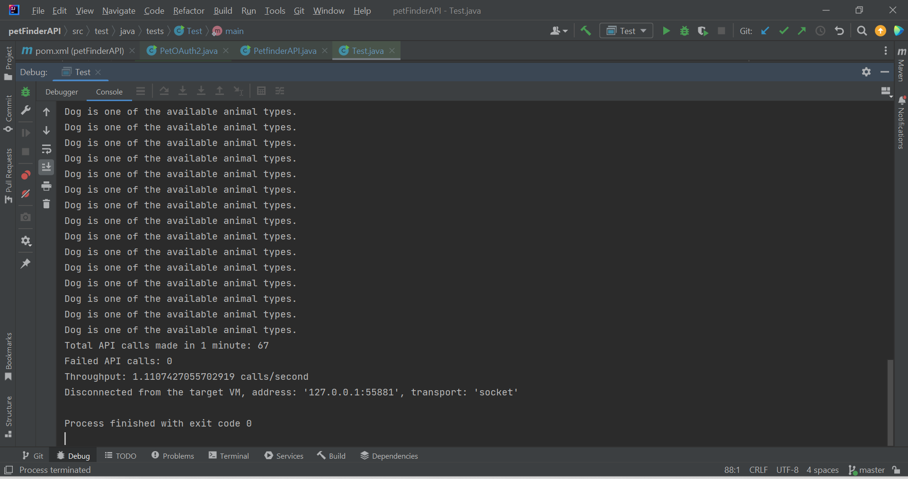
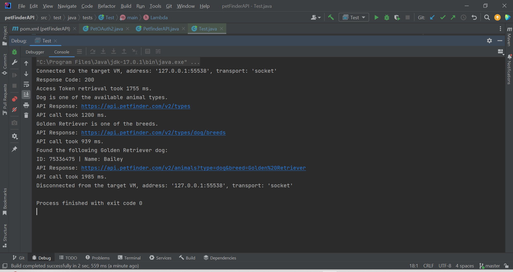
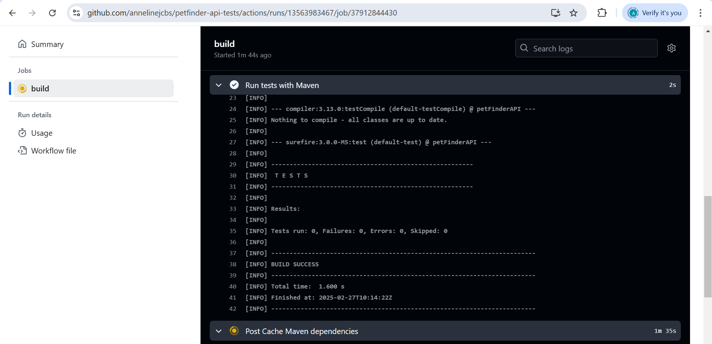
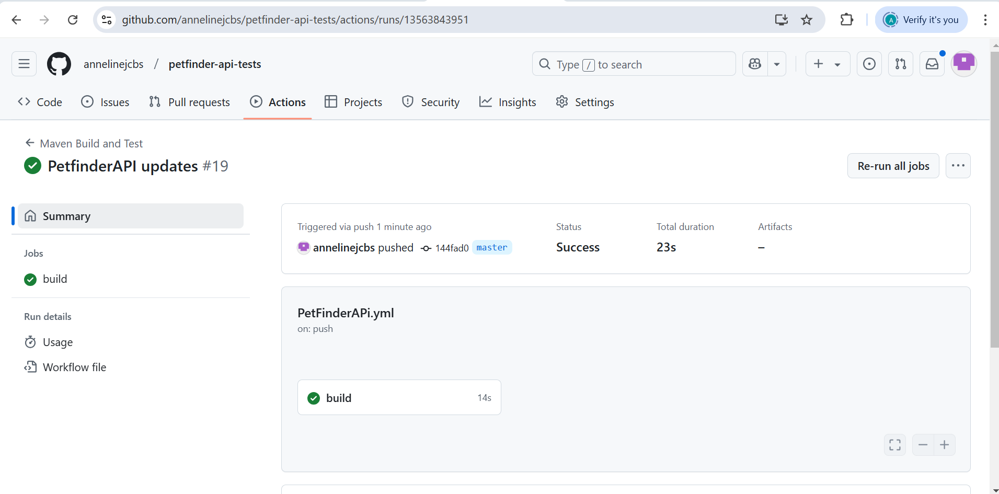

# Petfinder API Testing

This project is designed to test the **Petfinder API** for both functionality and performance. The tests include verifying different types of animals, dog breeds, and specifically searching for Golden Retrievers. Performance tests measure the API response time and throughput to ensure scalability.

## Table of Contents

- [Introduction](#introduction)
- [Prerequisites](#prerequisites)
- [Setup Instructions](#setup-instructions)
- [How to Run the Tests](#how-to-run-the-tests)
- [Project Structure](#project-structure)
- [Assumptions and Decisions](#assumptions-and-decisions)
- [Tools and Resources Used](#tools-and-resources-used)
- [License](#license)
- [Screenshot](#screenshot)


## Introduction

This project includes API tests for the **Petfinder API** that:
- Retrieves an **Access Token** for authorization.
- Retrieves the list of animal types and checks for **Dog**.
- Retrieves dog breeds and checks for the breed **Golden Retriever**.
- Searches for available **Golden Retrievers** in the database.
- Measures the performance of the API in terms of response time and throughput (calls per second).

## Prerequisites

Before running the tests, ensure you have the following:
- **Java 11** or higher installed.
- **Maven** (or another Java build tool) installed.
- **JUnit 5** for unit testing.
- **Apache HTTP Client** library for making HTTP requests.
- **Jackson** for JSON parsing.

## Setup Instructions

### 1. Clone the Repository

Clone the project from GitHub:


git clone https://github.com/yourusername/petfinder-api-tests.git
cd petfinder-api-tests

### 2. Install Dependencies
If you're using Maven, run the following command to install dependencies:

mvn install

### 3. Set Environment Variables
The PetOAuth2 class requires client ID and client secret to retrieve the access token. You can set these as environment variables:

export PETFINDER_CLIENT_ID=your-client-id
export PETFINDER_CLIENT_SECRET=your-client-secret

How to Run the Tests
You can run the tests using JUnit 5:

Using Maven:

mvn test

### Project Structure
```bash

The project is organized as follows:

petfinder-api-tests/
│
├── common/
│   ├── PetOAuth2.java           # Handles OAuth2 authentication to retrieve the access token.
│
├── tests/  
│   ├── PetfinderAPI.java        # Contains methods to interact with the Petfinder API (e.g., get animal types, dog breeds).
│   ├── Test.java                # Contains the main test class that runs tests on the Petfinder API.
│
└── pom.xml                      # Maven configuration file (dependencies, plugins, etc.)
```

### Key Files:

**PetOAuth2.java:** Contains the logic to retrieve an access token from the Petfinder API.
**PetfinderAPI.java:** Contains methods for interacting with the Petfinder API (e.g., retrieving animal types, dog breeds).
**Test.java:** The main test class that runs various tests, including performance tests and functionality checks.

**Assumptions and Decisions**

### Assumptions:

- The Petfinder API returns data in a standard JSON format.
- The tests assume that the API will be available and that valid credentials will be provided for authentication.
- The tests will check for specific values (like the presence of "Dog" or "Golden Retriever"), so if the API changes its data structure, the tests might fail.

### Decisions:

The tests will validate API responses with a maximum acceptable response time of 2 seconds. This was chosen based on typical API performance expectations.
OAuth2 authentication: The Petfinder API uses OAuth2 client credentials flow for authentication. Therefore, client ID and client secret are required to obtain an access token.
The tests focus on functionality first (validating the correct API responses), followed by performance testing (response time and throughput).

### Tools and Resources Used

**Java 11:** Programming language for implementing the tests.
**JUnit 5:** Testing framework used to write and run unit tests.
**Apache HTTP Client:** Used for making HTTP requests to interact with the Petfinder API.
**Jackson:** JSON parsing library to process the API responses.
**Maven:** Build and dependency management tool used to manage project dependencies.

### License
This project is licensed under the MIT License - see the LICENSE file for details.

### Screenshots
These screenshots demonstrate that the project runs successfully both on a local machine and through GitHub Actions.










